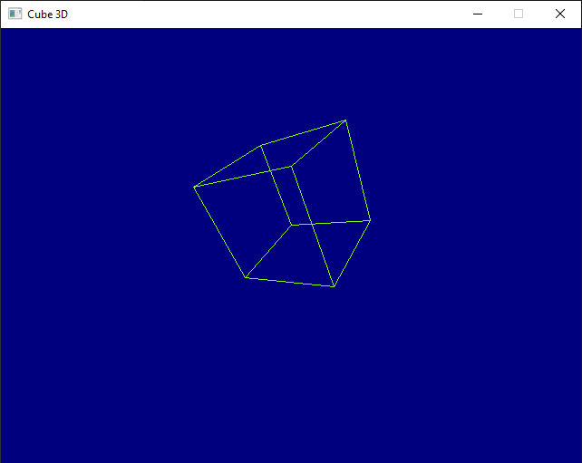

# Cube3D
A basic spinning and bouncing wireframe cube, written in C# with SDL2.

The SDL2 interop for C# comes from [Jeremy Sayers SDL Tutorial](https://jsayers.dev/c-sharp-sdl-tutorial-part-1-setup/)

